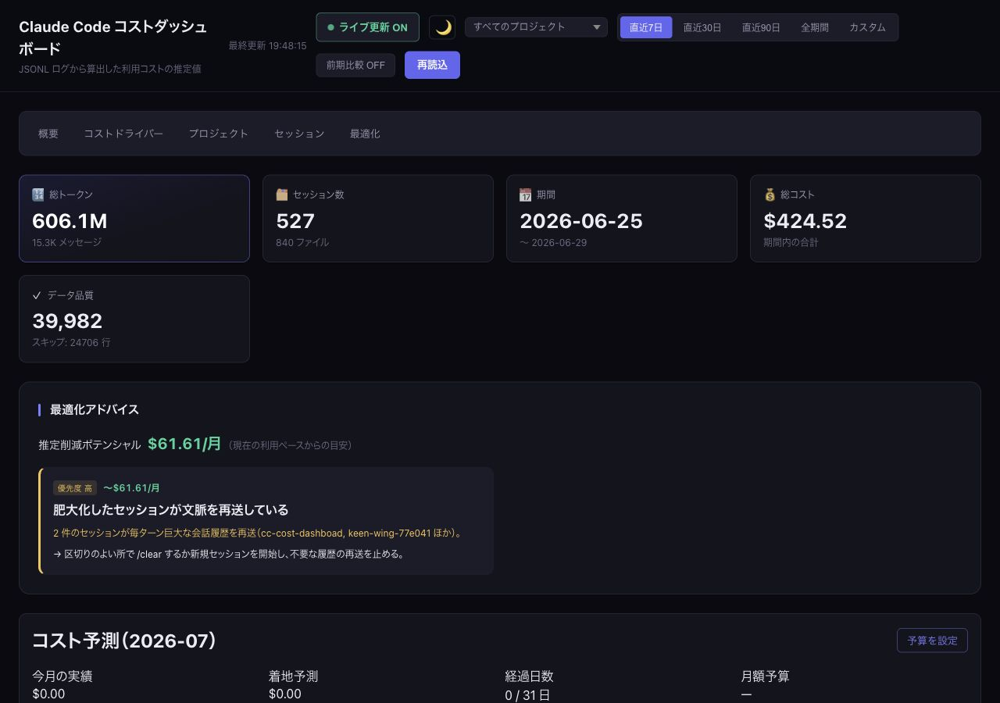
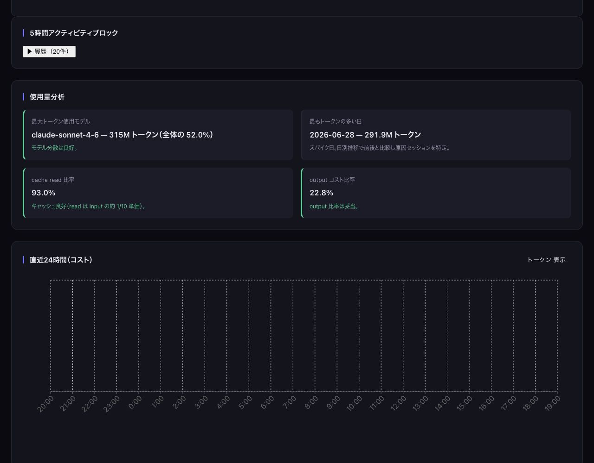
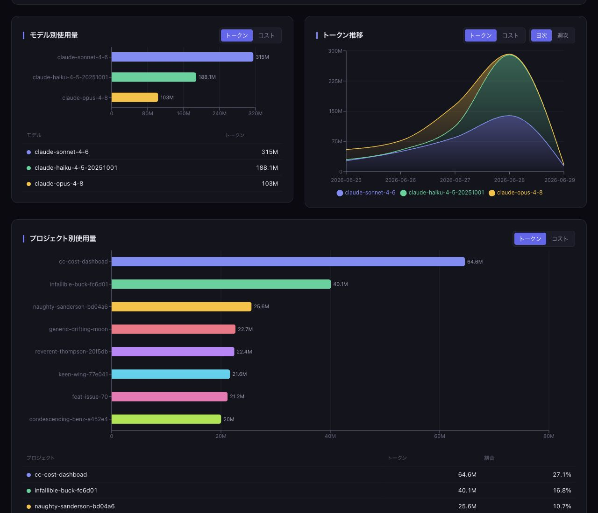
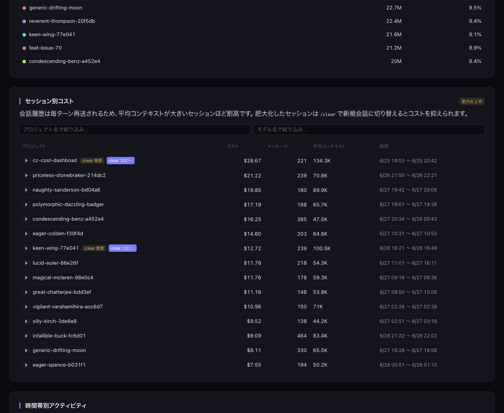
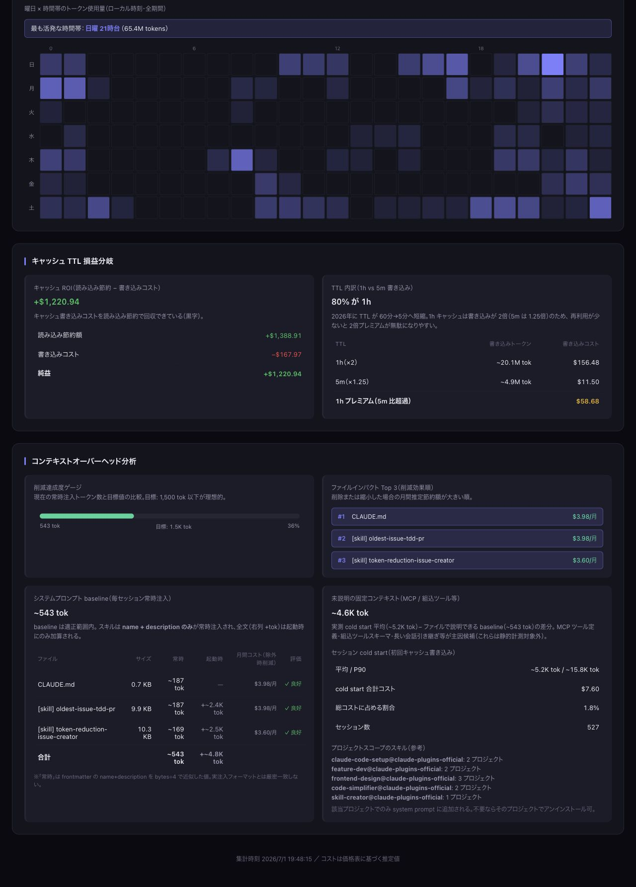

# Claude Code コストダッシュボード

`~/.claude/projects/` に蓄積された Claude Code の会話ログ（JSONL）を解析し、利用コストを可視化する Web アプリ。Claude Code 自体のコスト表示は常に $0 のため、**トークン数 × 価格表** から推定コストを独自計算する。

---

## スクリーンショット

### サマリ・最適化アドバイス



### 使用量分析・24時間推移



### モデル別・プロジェクト別使用量



### セッション別コスト・時間帯別アクティビティ



### キャッシュ TTL・コンテキストオーバーヘッド



---

## 必要環境

| ツール | バージョン |
|--------|-----------|
| Node.js | v18 以上（v26 推奨） |
| npm | v8 以上 |

---

## セットアップ

```bash
# 依存パッケージをインストール
npm install
```

---

## 環境変数

すべて任意（未設定でも動作する）。

| 変数 | 必須 | 説明 | 例 |
|------|------|------|-----|
| `PORT` | いいえ | Express API サーバーのポート番号（既定値: `3001`） | `4000` |
| `CLAUDE_LOGS_DIR` | いいえ | JSONL ログの読み込み元ディレクトリ（既定値: `~/.claude/projects`）。テストや複数環境の切り替えに使用 | `/path/to/logs` |

---

## 起動方法

### 開発モード（推奨）

```bash
npm run dev
```

- Express API サーバー（ポート 3001）と Vite 開発サーバー（ポート 5173）が同時起動する
- ブラウザで http://localhost:5173 を開く
- ファイル変更時にフロントが自動リロードされる
- `~/.claude/projects/**/*.jsonl` の変更も `server/watcher.js` が監視しており、更新時は SSE（`/api/events`）経由でブラウザ側が自動再取得する

### 本番モード

```bash
npm run build   # フロントをビルド
npm start       # API サーバー起動（ポート 3001 で UI も配信）
```

ブラウザで http://localhost:3001 を開く。

---

## ダッシュボードの見方

### サマリカード（画面上部）

| カード | 内容 |
|--------|------|
| 合計コスト | 全期間の推定コスト（USD） |
| 総トークン | 入力・出力・キャッシュを含む全トークン数 |
| セッション数 | ユニークなセッション ID の数 |
| 期間 | 最古〜最新のログ日付 |

> コストは **推定値**。価格表は `server/pricing.js` を参照。

---

### なぜコストが高いか（コストドライバパネル）

コスト増加の主因を 4 つの指標で表示する。

| 指標 | 見方 |
|------|------|
| **最大コストモデル** | 全体の何 % を占めるか。60% 超なら高単価モデルへの偏りが原因 |
| **最もコストの高い日** | スパイク日とその主因モデルを表示。日別推移グラフと照合する |
| **cache read 比率** | 高いほどキャッシュが効いている（read は input の約 1/10 単価）。50% 未満は要注意 |
| **output コスト比率** | 40% 超は生成トークンが高コスト要因。出力長・effort の見直しを検討 |

---

### モデル別コスト

- 横棒グラフ：モデルごとのコストを視覚比較
- 表：コスト（USD）・総トークン数・価格未登録モデルの警告バッジ

**価格未登録モデル**（`<synthetic>` 等の内部モデルは自動除外）が現れた場合、opus 価格で暫定計算される。画面上部に警告バナーが表示される。

---

### 日別コスト推移

モデル別に色分けした積み上げエリアグラフ。

- **スパイク日を目視特定**し、コストドライバパネルの「最もコストの高い日」と照合する
- グラフの凡例でモデルをクリックすると表示切り替えができる（Recharts 標準動作）

---

### 時間帯別アクティビティ

曜日 × 時間帯（0–23 時）のトークン使用量をヒートマップで表示する。

- セルの濃淡はその曜日・時間帯のトークン量に比例（最大値を基準に正規化）
- **最も活発な時間帯**を上部に表示し、利用パターンを一目で把握できる
- 時刻は**ローカルタイム**基準。期間セレクタの影響を受けない**全期間**集計

---

### コンテキストオーバーヘッド分析

セッションごとに注入されるシステムプロンプトのコストを分析する。

#### システムプロンプト推定サイズ

`~/.claude/` 配下の以下ファイルを実際に読み込み、サイズを計測する。

| ファイル種別 | 内容 |
|-------------|------|
| `CLAUDE.md` | グローバル設定・指示 |
| `@参照ファイル` | CLAUDE.md が `@filename` 形式で参照するファイル（例：RTK.md） |
| プラグイン CLAUDE.md | 有効プラグインが持つグローバル設定 |
| プラグイン SKILL.md | 有効プラグインの各スキル定義 |

> トークン推定は **バイト数 ÷ 4**（英語基準。日本語混在時はやや少なめに出る）。

**3,000 tokens 超過の場合**は削減を推奨するヒントが表示される。例：
- caveman プラグインの CLAUDE.md が 24 KB（≈ 6,100 tokens）ある場合、使わないスキルを無効化するか、プラグイン自体をアンインストールすると効果が大きい

#### セッション cold start 統計

セッション開始時、システムプロンプトはキャッシュに書き込まれる（`cache_creation`）。この初回書き込みコストを集計したもの。

| 指標 | 内容 |
|------|------|
| 平均初回キャッシュ作成 | 平均的なシステムプロンプトキャッシュサイズ |
| P90 初回キャッシュ作成 | 上位 10% のセッションにおけるサイズ |
| cold start 合計コスト | 全セッションの初回書き込みコスト合計 |

> 平均値がファイルベース推定値より大幅に多い場合、CLAUDE.md 以外の大きなコンテキスト（長い会話引き継ぎ等）が存在する。

---

## 再読込

画面右上の「再読込」ボタンを押すと、`~/.claude/projects/` を再スキャンして最新データに更新する。

---

## 価格表のカスタマイズ

`server/pricing.js` の `PRICING` オブジェクトを編集する。単位は USD / MTok（100万トークン当たり）。Claude 3 / 3.5 / 4 シリーズが登録済み。

```js
export const PRICING = {
  "claude-opus-4-8":   { input: 5, output: 25 },
  "claude-sonnet-5":   { input: 3, output: 15 },
  "claude-haiku-4-5":  { input: 1, output: 5 },
  "claude-fable-5":    { input: 10, output: 50 },
  // 行を追加すれば新モデルに対応。日付サフィックス（例 -20251001）は前方一致で自動解決される
};
```

キャッシュ単価は `costOf()` 関数内で自動計算される（write 5m = input × 1.25、write 1h = input × 2、read = input × 0.1）。価格表にないモデルは opus 相当の単価にフォールバックし、`isFallback: true` が付与される。

---

## データソース

| ファイル | 用途 |
|----------|------|
| `~/.claude/projects/**/*.jsonl` | Claude Code の会話ログ（メインデータ。`CLAUDE_LOGS_DIR` で変更可） |
| `~/.claude/settings.json` | 有効プラグイン一覧（オーバーヘッド分析用） |
| `~/.claude/CLAUDE.md` と @参照ファイル | システムプロンプトサイズ計測用 |
| `~/.claude/plugins/cache/` | プラグインのスキル定義（サイズ計測用） |
| `~/.claude/plugins/installed_plugins.json` | プロジェクトスコープのプラグイン一覧 |

ログファイルは**読み取り専用**でアクセスする。書き込みや削除は行わない。

---

## API エンドポイント

| メソッド・パス | 用途 |
|----------------|------|
| `GET /api/summary` | 集計サマリを返す。`period=7d\|30d\|90d\|all` または `from=YYYY-MM-DD&to=YYYY-MM-DD` で期間絞り込み |
| `POST /api/reload` | ログを再スキャンして再集計する（30 秒のレート制限あり） |
| `GET /api/hourly` | 全期間の時間帯別（0–23 時）集計を返す |
| `GET /api/events` | Server-Sent Events。ログファイル変更時に `update` イベントを配信する |
| `GET /api/sessions/:id/turns` | 指定セッション ID のターンごとのトークン・コスト内訳を返す |
| `GET /api/pricing` | 価格表（モデル別単価・キャッシュ倍率）を返す |

---

## アーキテクチャ

```
cc-cost-dashboad/
├── server/
│   ├── index.js      # Express API（ポート 3001。PORT 環境変数で変更可）
│   ├── parser.js     # JSONL 読み込み・正規化（CLAUDE_LOGS_DIR で読み込み元を変更可）
│   ├── aggregate.js  # モデル別/日別/プロジェクト別集計
│   ├── pricing.js    # 価格表 + costOf() 計算
│   ├── analyze.js    # システムプロンプトオーバーヘッド計測
│   └── watcher.js    # ~/.claude/projects の変更監視（デバウンス付き自動リロード）
└── src/
    ├── App.tsx
    ├── api.ts        # API クライアント + 型定義（データ形状の正）
    ├── format.ts     # 数値フォーマット + モデルカラー
    ├── weekly.ts      # 週次バーンレート計算
    ├── advisor.ts     # 最適化アドバイスロジック
    └── components/    # UI コンポーネント一式（SummaryCards, CostDrivers,
                        # ModelBreakdown, DailyTrend, ActivityHeatmap,
                        # OverheadAnalysis, BudgetProjection, OptimizationAdvisor,
                        # ProjectBreakdown, SessionBreakdown, BillingBlocks,
                        # PeriodSelector, ContextBudget, ThinkingBreakdown,
                        # ToolBreakdown, McpServerBreakdown, SubagentBreakdown 等）
```

**データフロー：**

```
~/.claude/projects/**/*.jsonl
       ↓ parser.js（readline ストリーム、<synthetic> 等の内部モデルは除外）
 正規化レコード配列
       ↓ aggregate.js（1 パス集計）
   サマリ JSON
       ↓ analyze.js（ファイルシステム読み取り）
 オーバーヘッド情報を追記
       ↓ /api/summary または /api/reload
   React ダッシュボード（Recharts）

watcher.js が並行して ~/.claude/projects を監視し、
変更検知時に自動で rebuild() → SSE（/api/events）でブラウザへ通知する
```

---

## よくある質問

**Q. コストが実際の請求額と違う**
実際の Claude Code 請求額とは異なる推定値。キャッシュの 1h / 5m 判定、モデルのバージョン差、Claude Code 独自の割引・無料枠は反映されない。傾向把握・削減検討用の参考値として使う。

**Q. `<synthetic>` モデルが警告に出ない**
正常。Claude Code 内部処理用の合成モデルはパーサーで除外済み（実コスト発生なし）。

**Q. 再読込しても金額が変わらない**
`~/.claude/projects/` 配下に新しいログが追加されていない場合は変化しない。Claude Code でセッションを終了・再開した後に再読込すると更新される。

**Q. ポート 3001 が使用中でエラーになる**
```bash
lsof -ti:3001 | xargs kill
npm run dev
```

**Q. 価格表にないモデルが使われていた**
`server/pricing.js` に追記する。追記前は opus 価格で計算され、UI に「価格未登録」バッジが表示される。
